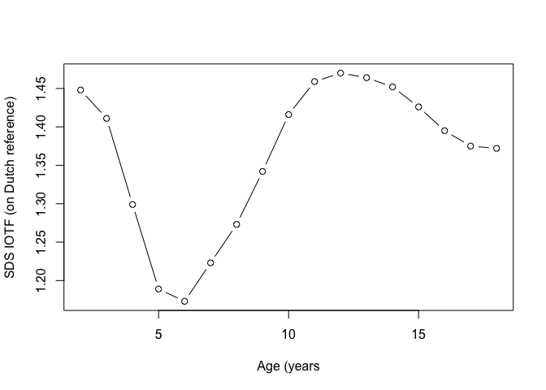

<!-- README.md is generated from README.Rmd. Please edit that file -->

# [AGD: Analysis of Growth Data](https://stefvanbuuren.name/AGD/)

The [`AGD`](https://cran.r-project.org/package=AGD) package implements
various tools that aid in the analysis of growth data.

## Installation

The `AGD` package can be installed from CRAN as follows:

``` r
install.packages("AGD")
```

The latest version is can be installed from GitHub as follows:

``` r
install.packages("remotes")
remotes::install_github(repo = "stefvanbuuren/AGD")
```

## Minimal example

``` r
library(AGD)

# What is the SDS of a height of 115 cm at age 5 years
# relative to Dutch references?
# Calculate for boys and girls:
y2z(y = c(115, 115), x = 5, sex = c("M", "F"))
#> [1] 0.424 0.706

# What are the SDS of the IOTF BMI cut-off values for 
# overweight (boys 2-18) relative to Dutch references?
cutoff <- c(
18.41, 17.89, 17.55, 17.42, 17.55, 17.92, 18.44, 19.10, 
19.84, 20.55, 21.22, 21.91, 22.62, 23.29, 23.90, 24.46,  
25.00)
age <- 2:18
z <- y2z(y = cutoff, x = 2:18, sex = "M", ref = nl4.bmi)
plot(age, z, type = "b", xlab = "Age (years", 
     ylab = "SDS IOTF (on Dutch reference)")
```

<figure>

<figcaption aria-hidden="true">Standard deviation score of IOTF
overweight cut-off relative to Dutch reference</figcaption>
</figure>
